# tRPC-Go 学习 Demo · User 服务

一个用于学习 **tRPC-Go 框架** 工作原理的最小可运行 demo。
- 业务：内存版 User 服务（`GetUser` / `CreateUser` / `ListUser`），与 `../day07-web-server` 的 HTTP 版业务等价。
- 形态：**手写桩代码**（不依赖 protoc，但跑的是真实的 tRPC 私有协议）。
- 目标：把 protoc 自动生成的 `.pb.go` 摆开来人手写一遍，看清 tRPC-Go 的契约边界——剩下的都是它的运行时（transport / codec / filter / router）。

> 本 demo 只展示 tRPC 协议核心。名字服务、监控、链路追踪、限流熔断等高级特性已刻意省略，以便聚焦协议本身。

---

## 目录

- [1. 项目结构](#1-项目结构)
- [2. 运行步骤](#2-运行步骤)
- [3. 底层原理：tRPC 协议帧格式](#3-底层原理trpc-协议帧格式)
- [4. 手写桩代码原理](#4-手写桩代码原理)
- [5. 调用链路](#5-调用链路)
- [6. RPC vs HTTP 对比](#6-rpc-vs-http-对比)
- [7. 抓包验证](#7-抓包验证)
- [8. 进阶练习](#8-进阶练习)

---

## 1. 项目结构

```text
tRPC-go-demo/
├── go.mod                 # 独立 module: trpc-go-demo（与主 study_go 隔离）
├── go.sum
├── trpc_go.yaml           # 服务端最简配置（端口 / 协议 / 序列化）
├── README.md              # 本文档
├── api/user/
│   ├── user.go            # 手写 message struct（带 json tag）
│   └── user.trpc.go       # 手写桩代码：ServiceDesc + Method.Func + ClientProxy
├── server/
│   ├── main.go            # trpc.NewServer + 注册 User 服务
│   └── service.go         # UserServiceImpl：内存存储 + RWMutex
└── client/
    └── main.go            # 通过 UserClientProxy 顺序调用三个接口
```

---

## 2. 运行步骤

### 2.1 准备依赖

```powershell
# 建议公网用户配置代理（拉取 trpc.group 包）
$env:GOPROXY = "https://goproxy.cn,direct"

cd tRPC-go-demo
go mod tidy
```

### 2.2 启动服务端

服务端必须在 `tRPC-go-demo/` 根目录启动（因为框架默认从当前目录找 `trpc_go.yaml`）：

```powershell
cd tRPC-go-demo
go run ./server
```

启动成功后能看到：

```text
INFO  server/main.go:32  tRPC-Go demo server starting...
INFO  server/main.go:33  ServiceName: trpc.demo.user.User
INFO  server/main.go:34  Listen     : 0.0.0.0:8000  (protocol=trpc, serialization=json)
INFO  server/service.go:168  trpc service:trpc.demo.user.User launch success, tcp:0.0.0.0:8000, serving ...
```

### 2.3 运行客户端（另开一个终端）

```powershell
cd tRPC-go-demo
go run ./client
```

预期输出：

```text
==========================================================
  tRPC-Go demo client → trpc.demo.user.User
==========================================================
[CreateUser] req={name:"Alice"} → rsp.user={id:1, name:"Alice"}  cost=5.4ms
[CreateUser] req={name:"Bob"}   → rsp.user={id:2, name:"Bob"}    cost=540µs
[ListUser]   total=2  cost=560µs
             - id=1 name="Alice"
             - id=2 name="Bob"
[GetUser]    req={id:1}   → rsp.user={id:1, name:"Alice"}        cost=530µs
[GetUser]    req={id:999} → ERROR code=404 msg="user not found"  cost=565µs
==========================================================
  done.
```

注意最后一行：业务错误码 `404` 是服务端用 `errs.New(404, "user not found")` 返回的，**经过 tRPC 协议透明传到了客户端**——这是 RPC 框架相比 HTTP 直接 status code 的一个明显优势：业务错误和框架错误分离，且二者都能携带详细信息。

---

## 3. 底层原理：tRPC 协议帧格式

> **核心问题：你在网线上抓到的字节，到底是怎么排列的？**

tRPC 是一个 **二进制 + 长度前缀** 的私有协议，每一个 RPC 请求/响应都是一个完整的"帧"：

```text
┌─────────────────────────────────────────────────────────────────┐
│                        tRPC 一应一答帧                            │
├──────────────┬──────────────────────┬───────────────────────────┤
│  FrameHead   │     PB Package Head  │     Body (业务包体)         │
│   16 字节     │       变长 (PB)       │   变长 (JSON / PB / ...)   │
└──────────────┴──────────────────────┴───────────────────────────┘
   定长固定头         元数据 (路由/超时)         实际请求/响应数据
```

整帧最大 10MB（可通过 `trpc.DefaultMaxFrameSize` 调整）。

### 3.1 FrameHead：定长 16 字节

| 字节  | 字段名             | 长度 | 含义                                                                   |
| ---- | ----------------- | --- | ----------------------------------------------------------------------- |
| 0-1  | Magic             | 2B  | **魔数 `0x0930` (= 2352)**，用于识别 tRPC 帧。抓包时认这个就行           |
| 2    | DataFrameType     | 1B  | `0x00`=Unary（一应一答）；`0x01`=Stream（流式）                           |
| 3    | StreamFrameType   | 1B  | 仅 Stream 有效：`0x01` Init / `0x02` Data / `0x03` Feedback / `0x04` Close |
| 4-7  | TotalSize         | 4B  | 整帧总长 = 16 + 包头长 + 包体长（**大端**）                                 |
| 8-9  | PBHeadSize        | 2B  | PB 包头长度（仅 Unary 有效，Stream 始终为 0）                               |
| 10-13 | StreamID         | 4B  | 仅 Stream 有效                                                          |
| 14-15 | Reserved         | 2B  | 保留字段                                                                |

**ASCII 图示（Unary）：**

```text
偏移:   0   1   2   3   4   5   6   7   8   9   10  11  12  13  14  15
       ┌───┬───┬───┬───┬───┬───┬───┬───┬───┬───┬───┬───┬───┬───┬───┬───┐
       │ 09│ 30│ 00│ 00│  TotalSize    │ HeadSz│       0       │   0   │
       └───┴───┴───┴───┴───────────────┴───────┴───────────────┴───────┘
        ↑─ Magic ─↑   ↑Type↑Stream↑                      ↑─ StreamID ─↑   Reserved
```

### 3.2 PB 包头：路由 / 超时 / 透传字段

帧头之后紧跟一段 protobuf 序列化的 `RequestProtocol`（请求方向）或 `ResponseProtocol`（响应方向）。**注意：包头始终是 PB，跟你包体用什么序列化没关系**。

`RequestProtocol` 关键字段（业务侧最关心的几个）：

```protobuf
message RequestProtocol {
  uint32 version       = 1;  // 协议版本
  uint32 call_type     = 2;  // 0=普通调用，1=单向调用
  uint32 request_id    = 3;  // 请求唯一 ID（用于多路复用时匹配 req/rsp）
  uint32 timeout       = 4;  // 调用方剩余超时（毫秒），用于全链路超时透传
  bytes  caller        = 5;  // 调用方服务名 (trpc.app.server.service)
  bytes  callee        = 6;  // 被调方服务名
  bytes  func          = 7;  // 全限定 RPC 名 /trpc.demo.user.User/GetUser
  uint32 message_type  = 8;  // 消息类型 (染色/调用链/灰度...)
  map<string, bytes> trans_info = 9;  // 透传 KV（业务可塞自定义元数据）
  uint32 content_type     = 10; // 序列化方式：0=PB / 2=JSON / 3=FB / 5=XML ...
  uint32 content_encoding = 11; // 压缩方式：0=不压缩 / 1=gzip / 2=snappy ...
}
```

`ResponseProtocol` 几乎对称，但多了 `int32 ret`（框架错误码）和 `int32 func_ret`（业务错误码）。

**这就是为什么手写桩代码不需要操心路由信息**——你只要在 `codec.Message` 上调用 `WithCalleeServiceName / WithClientRPCName / WithSerializationType`，框架就会替你把这些字段填进 PB 包头里。

### 3.3 Body：业务包体

包头之后就是业务数据，由 `codec.SerializationType` 决定格式：

| Type | 常量                              | 备注                                |
| ---- | --------------------------------- | ----------------------------------- |
| 0    | `SerializationTypePB`             | protobuf（默认）                     |
| 2    | `SerializationTypeJSON`           | JSON（**本 demo 用这个**）           |
| 3    | `SerializationTypeFlatBuffer`     | flatbuffer                          |
| 5    | `SerializationTypeXML`            | XML                                 |

**本 demo 选择 JSON 的原因**：手写 message struct 不用 `proto.Message` 接口，避开 `protoc-gen-go` 工具链。代价：CPU 开销略高于 PB，但学习场景完全够用。

### 3.4 GetUser 调用的字节级走查（举例）

客户端发出 `GetUser({ID: 1})`，网线上的字节大致长这样：

```text
─── FrameHead (16B) ──────────────────────────────────────────────
09 30                  ← Magic 0x0930
00                     ← DataFrameType: Unary
00                     ← StreamFrameType: 不用
00 00 00 7E            ← TotalSize: 126 字节（举例）
00 6B                  ← PBHeadSize: 107 字节（PB 包头长）
00 00 00 00            ← StreamID: 不用
00 00                  ← Reserved

─── PB Package Head (107B) ───────────────────────────────────────
[ protobuf encoded RequestProtocol ]
   request_id=1
   func="/trpc.demo.user.User/GetUser"
   callee="trpc.demo.user.User"
   content_type=2 (JSON)
   timeout=2000

─── Body (3B) ────────────────────────────────────────────────────
{"id":1}        ← JSON 包体
```

服务端处理流程（精确对应上面的字节）：

```text
1. transport accept → 读出至少 16 字节
2. framer 校验：buf[0]==0x09 && buf[1]==0x30 ?  否则丢弃
3. 解 TotalSize → 等待 buf 凑齐 126 字节
4. 解 PBHeadSize=107 → 切出 [16, 16+107) 这段做 PB 反序列化 → 得到 RequestProtocol
5. 从 RequestProtocol.func 拿 RPC 名 → 路由到 ServiceDesc.Methods 中匹配的 Method.Func
6. 把剩下的 [16+107, 126) 字节交给 Method.Func 闭包内的 f(req) → 用 JSON Unmarshal 填到 GetUserReq{}
7. 调用业务方法 → 拿到 *GetUserRsp
8. 反向封帧：JSON Marshal rsp + PB Encode ResponseProtocol + 填 FrameHead → write 回去
```

---

## 4. 手写桩代码原理

protoc 自动生成的 `.pb.go` / `.trpc.go` 看起来很复杂，但**真正必要的内容只有三块**。我们逐一拆开。

### 4.1 ServiceDesc：注册元信息

```go
// api/user/user.trpc.go
var UserServer_ServiceDesc = server.ServiceDesc{
    ServiceName: "trpc.demo.user.User",
    HandlerType: ((*UserService)(nil)),
    Methods: []server.Method{
        {Name: "/trpc.demo.user.User/GetUser",    Func: UserService_GetUser_Handler},
        {Name: "/trpc.demo.user.User/CreateUser", Func: UserService_CreateUser_Handler},
        {Name: "/trpc.demo.user.User/ListUser",   Func: UserService_ListUser_Handler},
    },
}
```

**框架要的就这一个 ServiceDesc**：
- `ServiceName` 必须与 `trpc_go.yaml` 中 `server.service[].name` 完全一致；
- `HandlerType` 是接口类型零值指针，给 `s.Register` 做类型断言用；
- `Methods` 是路由表：从"全限定 RPC 名"到"处理函数"的映射。

### 4.2 Method.Func：服务端 handler 闭包

来自 SDK 的签名：

```go
type Method struct {
    Name string
    Func func(svr interface{}, ctx context.Context, f FilterFunc) (rspBody interface{}, err error)
}

type FilterFunc func(reqBody interface{}) (filter.ServerChain, error)
```

我们的实现（`UserService_GetUser_Handler`）：

```go
func UserService_GetUser_Handler(svr interface{}, ctx context.Context, f server.FilterFunc) (interface{}, error) {
    req := &GetUserReq{}                       // ① 创建空 req
    filters, err := f(req)                     // ② 让框架反序列化 req + 拿 filter chain
    if err != nil { return nil, err }
    handleFunc := func(ctx context.Context, reqBody interface{}) (interface{}, error) {
        return svr.(UserService).GetUser(ctx, reqBody.(*GetUserReq))  // ③ 调用业务接口
    }
    return filters.Filter(ctx, req, handleFunc) // ④ 跑 filter chain → 业务方法
}
```

四步动作请细品：第 ② 步是关键——**`f(req)` 这一调用同时做了两件事**：把网络字节用 codec 反序列化进 `req`，同时返回这个 RPC 应该走的 server filter chain。设计妙在 filter 链可以拿到反序列化后的 req，从而做日志、鉴权、限流等横切关注点。

### 4.3 ClientProxy：客户端代理

```go
type UserClientProxy interface {
    GetUser(ctx context.Context, req *GetUserReq, opts ...client.Option) (*GetUserRsp, error)
    // ...
}

func (c *userClientProxyImpl) GetUser(ctx context.Context, req *GetUserReq, opts ...client.Option) (*GetUserRsp, error) {
    ctx, msg := codec.WithCloneMessage(ctx)
    defer codec.PutBackMessage(msg)

    // 把 RPC 元信息塞进 codec.Message（不是 client.Option！）
    msg.WithClientRPCName("/trpc.demo.user.User/GetUser")
    msg.WithCalleeServiceName(UserServer_ServiceDesc.ServiceName)
    msg.WithCalleeMethod("GetUser")
    msg.WithSerializationType(codec.SerializationTypeJSON)

    rsp := &GetUserRsp{}
    return rsp, c.client.Invoke(ctx, req, rsp, opts...)
}
```

**容易踩的坑**：你可能以为 `WithCalleeServiceName / WithCalleeMethod` 这种是 `client.Option`，实际上它们是**写在 `codec.Message` 上**的方法。`client.Option` 只管传输层（Target、Protocol、Timeout、Filter 等），路由信息归 Message 管。这是 tRPC-Go 的一个设计分层。

### 4.4 RegisterUserService：业务侧入口

```go
func RegisterUserService(s server.Service, svr UserService) {
    if err := s.Register(&UserServer_ServiceDesc, svr); err != nil {
        panic(fmt.Sprintf("User service register error: %v", err))
    }
}
```

注意第一个参数 **传指针 `&UserServer_ServiceDesc`**。SDK 内部会做 `serviceDesc.(*ServiceDesc)` 断言，传值会 panic。

---

## 5. 调用链路

```mermaid
flowchart LR
    subgraph 客户端进程
        A[业务代码<br/>proxy.GetUser] --> B[手写 ClientProxy<br/>设置 RPCName]
        B --> C[client.Client.Invoke]
        C --> D[ClientFilter 链]
        D --> E[Codec.Encode<br/>JSON包体+PB包头+帧头]
        E --> F[Transport 发送]
    end
    F == TCP / tRPC 协议帧 ==> G
    subgraph 服务端进程
        G[Transport accept] --> H[Framer 分帧<br/>校验魔数 0x0930]
        H --> I[Codec.Decode<br/>解 PB 包头+JSON包体]
        I --> J[Server Router<br/>按 RPC 名找 Method]
        J --> K[Method.Func 闭包<br/>反序列化 req]
        K --> L[ServerFilter 链]
        L --> M[UserServiceImpl<br/>业务逻辑+RWMutex]
        M --> N[原路打回]
    end
```



---

## 6. RPC vs HTTP 对比

把本 demo 与 `../day07-web-server` 放在一起对比：

| 维度        | day07 HTTP 版                      | 本 demo tRPC 版                        |
| ---------- | ---------------------------------- | -------------------------------------- |
| 接口定义     | URL + JSON                         | `ServiceDesc.Methods` + 强类型 Req/Rsp |
| 调用风格     | `http.Post(url, body)`             | `proxy.GetUser(ctx, req)` 像调本地函数   |
| 错误模型     | HTTP status code (200/400/...)     | 框架码 + 业务码（双层）                  |
| 元数据透传   | HTTP Header（字符串）                | `trans_info` map + 强类型 RequestProtocol |
| 序列化       | JSON 文本（必）                       | JSON / PB / FB / XML 可插拔            |
| 全链路超时   | 业务自己塞 Header / Context           | `RequestProtocol.timeout` 协议级支持    |
| 协议体积     | 文本，包含 method + path + headers   | 二进制，固定 16B 帧头 + PB 紧凑编码      |
| 性能（典型） | QPS 1w-3w，延迟 2-5ms                | QPS 5w-10w，延迟 0.5-1ms               |
| 调试友好度   | 高（curl 即可）                       | 低（需要专用工具或 SDK 客户端）          |
| 服务治理     | 需要自建（注册中心 / 限流 / ...）       | 框架原生（北极星 / 监控 / filter）       |

**结论**：HTTP 适合开放 API、对外接口、调试场景；tRPC 适合内部服务间高并发调用，框架治理能力是真正的杀手锏。

---

## 7. 抓包验证

让你亲眼看到 16 字节帧头的字节排列：

### 7.1 Wireshark（推荐）

1. 启动服务端：`go run ./server`
2. 打开 Wireshark，capture interface 选 **Adapter for loopback traffic capture**（Windows 装好 npcap 后会有）。
3. 在过滤栏输入 `tcp.port == 8000`。
4. 启动客户端：`go run ./client`。
5. 在抓到的包上右键 → Follow → TCP Stream → 切换到 **Hex Dump** 视图。

你会看到每一段流的开头都是 `09 30`，紧接着是 4 字节的 TotalSize、2 字节的 PBHeadSize……完全对应第 3 节的字段表。

### 7.2 tcpdump（Linux/WSL）

```bash
sudo tcpdump -i lo port 8000 -X -nn
```

观察 `0x0000` 偏移开头的字节，前 16 字节就是 FrameHead。

### 7.3 写一个 server filter 自己 dump

如果不想装 Wireshark，可以写一个 filter 在解码完成后打印整个 `codec.Message`，观察解码出来的字段。这是阅读 trpc-go 源码的常见入口。

---

## 8. 进阶练习

完成本 demo 后，你可以挑战：

1. **加一个 ServerFilter**：在每个 RPC 调用前后打印耗时（提示：`server.WithFilter`）。
2. **加一个 ClientFilter**：自动重试失败请求（提示：`client.WithFilter`）。
3. **改用 PB 序列化**：写一份 `.proto` 文件，用 trpc-cmdline 生成桩代码，对比"自动生成"和本 demo "手写"的差异。
4. **超时透传**：客户端 `client.WithTimeout(100ms)` → 服务端故意 sleep 200ms，观察服务端是否能感知到超时（看 `RequestProtocol.timeout`）。
5. **接入北极星**：把 `client.WithTarget("ip://127.0.0.1:8000")` 换成 `polaris://trpc.demo.user.User`，体验服务发现。
6. **自己实现一个 Codec**：注册一个新的序列化方式（比如 msgpack），在 yaml 里 `serialization: 99` 切过去。

---

## 参考资料

- [trpc-go 开源仓库](https://github.com/trpc-group/trpc-go)
- [trpc-go examples/helloworld](https://github.com/trpc-group/trpc-go/tree/main/examples/helloworld)
- [tRPC 协议规范](https://github.com/trpc-group/trpc/blob/main/docs/zh/protocol_design.md)
- 本仓库 `../day07-web-server`：HTTP 版 User 服务对照
